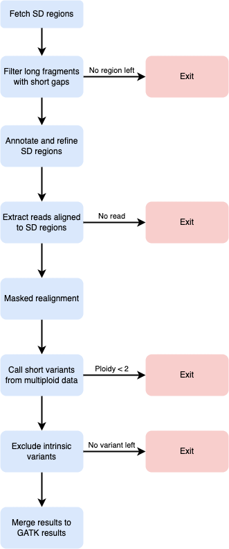

# SDrecall

SDrecall is the prototype of a tool for calling short variants that may be missed by GATK best practice by ascertaining segmental duplication regions. It only supports hg19 build now.

## Prerequisites
* [samtools](http://www.htslib.org/) >=v1.15
* [BEDTools](https://bedtools.readthedocs.io/en/latest/) >=v2.30.0
* [BISER](https://github.com/0xTCG/biser) >=v1.1
* [seqkit](https://github.com/shenwei356/seqkit) >=v2.2.0
* [seqtk](https://github.com/lh3/seqtk) >=v1.3
* [GATK](https://gatk.broadinstitute.org/hc/en-us) >=v4.2.6.1
* [bwa](https://github.com/lh3/bwa) >=v0.7.17
* [GCC](https://gcc.gnu.org/) >=v9.1.0
* [Python](https://www.python.org/downloads/) >=v3.9.2
* [HTSlib](http://www.htslib.org/download/) >=v1.14
* [VCFPy](https://github.com/bihealth/vcfpy) >=v0.13.4
* [mosdepth](https://github.com/brentp/mosdepth) >=v0.3.3
* [bcftools](http://www.htslib.org/download/) >=v1.14

## Installation
For conda users, create an environment from YAML.
```{bash}
conda env create -f ./setup/environment.yml
conda activate SDrecall
```
For users who wish not to install conda locally may download [Singularity](https://docs.sylabs.io/guides/3.0/user-guide/quick_start.html). Singularity allows users to build a container from an image pulled from Singularity hub without root privilege. A CentOS image is provided here.

```{bash}
# - Clone from a temporary repository until actual release - #
cd setup && singularity build svsd.sif svsd.def # This step may take some time
singularity shell svsd.sif # Create a Singularity shell
conda env create -f ./setup/environment.yml
source /opt/miniconda/bin/activate SDrecall
```

## Input files
### Required
* Base Quality Score Recalibrated (BQSR) BAM file
* Gene annotation file ([NCBI RefSeq data](https://github.com/snakesch/SDrecall/blob/main/doc/customRun.md#gene-annotation-file))

### Optional
* A gene panel in BEDPE format (See [part 0.4](https://github.com/snakesch/SDrecall/blob/main/doc/customRun.md#04-annotate-and-extract-regions-of-interest))

## Quick run
```{bash}
Usage:    ./wrapper.sh

Required:
          --input-bam|-i          | input BQSR BAM file
          --ref-bed|-rb           | BED file of reference genome
          --ref-genome|-rg        | reference genome
          --anno-ref|-a           | annotation table
          --out|-o                | output directory (default: ./out)

Optional:
          --fraglen|-f            | fragment length FRAGLEN in CIGAR processing (default: 300)
          --gaplen|-g             | small gap cutoff GAPLEN in CIGAR processing (default: 10)
          --mq|-mq                | MQ threshold for extracting multi-aligned reads (default: 30)
          --thread|-t             | max number of threads (default: 8)
          --log                   | log level (default: INFO)
          --gene-list|-l          | list of genes of interest
```
## Custom run
As users may allocate different number of threads in each step, custom run allows users to execute each step separately with a defined number of threads. Users are advised to reserve more threads for WGS data as described [here](doc/customRun.md).

## Workflow
<p align="center">
  
</p>

## Contact and correspondance
Xingtian Yang (u3005579@connect.hku.hk), Louis She (louisshe@hku.hk)
