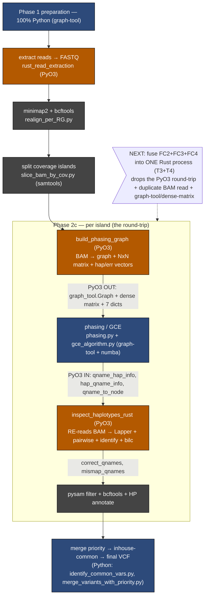
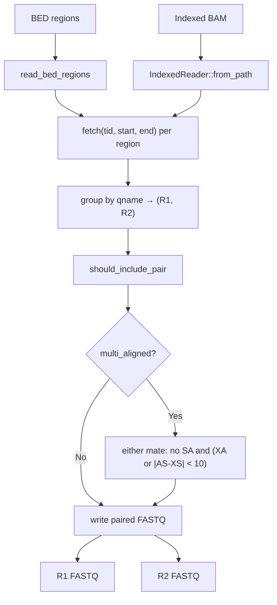

# SDrecall Rust Migration Plan and Design Record

## Current state (2026-07-17)

The migration implementation is operational: the 11-crate workspace and the `sdrecall` orchestrator run the complete preparation, realignment, FP-control, and VCF pipeline. Retained t2t/chm13, hg19, and hg38 runs pass the production semantic contracts for VCF records, FASTQs, ordered normalized BAM records, read classifications, clique partitions, and processed islands.

The production definition is now **Rust orchestration with no Python runtime**. Mature `samtools`, `bcftools`, and `minimap2` commands may remain where they are the reliable implementation; replacing those tools with Rust/FFI is optional future engineering, not a migration blocker.

Remaining closeout work is deliberately narrow:

1. wire the validated `nm-stats` Poisson cutoff into the orchestrator FP-control path;
2. record the formal full-pipeline HG006 Rust-versus-Python differential;
3. continue measured performance work on post-graph inspection, repeated FC/NFC extraction, and graph/CSR memory overlap; and
4. follow the completed hg38 exact allele/dosage screen with haplotype-aware GIAB evaluation and false-positive stratification.

Completed closeout: the unused PyO3/Python bindings, `cdylib` surfaces, Maturin metadata, checked-in wheel, and pyo3/numpy/pyo3-log dependencies were removed on 2026-07-17. Workspace/all-target formatting, strict Clippy (`-D warnings`), tests, doctests, and release builds pass. The first hg38 Rust+DeepVariant exact screen also completed: accepted SDrecall calls raised exact-allele recall from 0.550546 to 0.883880 but reduced precision from 0.968750 to 0.416613.

## Historical north star (2026-06-10)

The original plan required a single `sdrecall` Rust binary, no Python interpreter, no PyO3, and a preference for in-process Rust I/O. That goal drove the crate decomposition and remains useful design history. Its stricter "replace all samtools/bcftools shelling" interpretation is superseded by the July production policy above.

The June estimate of **82 s → ~15–25 s/island** was a planning target, not the current benchmark contract. Current performance claims must use the retained July stage timings and semantic-parity gates.

---

## Historical dataflow — Flowchart A: pure Python baseline

```mermaid
flowchart TD
    IN[/"input BAM + ref FASTA + SD-map BED + target BED"/]
    subgraph P1["Phase 1 — prepare_recall_regions.py (graph-tool, I/O-bound)"]
        IN --> P1a["pick multi-aligned regions<br/>pick_multialigned_regions@pick_multialign_regions.py (4-way depth)"]
        P1a -->|"multi-align BED"| P1b["filter SD map + umbrella pairs<br/>filter_umbrella_pairs@sd_pairs.py"]
        P1b --> P1c["build multiplex graph<br/>create_multiplex_graph@graph_build.py (networkx)"]
        P1c -->|"GraphML"| P1d["traverse → SD paralog pairs<br/>graph_query.py + graph_traversal.py (graph-tool + minimap2)"]
        P1d --> P1e["group nodes via coloring<br/>optimal_node_grouping@graph_query.py"]
        P1e --> P1f["per-RG masked genomes + intrinsic BAM<br/>build_beds_and_masked_genomes.py (minimap2)"]
    end
    P1f -->|"per-RG masked FASTA, intrinsic BAM, query BEDs"| P2a
    subgraph P2["Phase 2 — SDrecall_per_sample / realign_and_recall.py"]
        P2a["prepare align regions<br/>prepare_masked_align_region.py"] -->|"fc/nfc BED"| P2b["extract reads→FASTQ<br/>read_extraction.py"]
        P2b -->|"FASTQ"| P2c["minimap2 realign + bcftools call<br/>realign_per_RG.py"]
        P2c -->|"raw masked BAM+VCF"| P2d["merge + markdup → deduped_raw_bam + pooled_raw_vcf"]
        P2d --> ME1["split into coverage islands<br/>split_bam_by_cov@slice_bam_by_cov.py"]
        ME1 -->|"per-island raw BAM + intrinsic BAM + BED"| FC
    end
    subgraph FC["Phase 2c — realign_filter_per_cov.py (parallel per island, ~82s)"]
        FC1["BAM→NCLS<br/>migrate_bam_to_ncls@bam_ncls.py (19s)"] --> FC2["build phasing graph<br/>build_phasing_graph@graph_build.py (2s)"]
        FC2 -->|"graph + weight matrix + hap/err vectors"| FC3["phasing / GCE<br/>phasing_realigned_reads@phasing.py + gce_algorithm.py (5s)"]
        FC3 -->|"qname_hap_info, hap_qname_info"| FC4["inspect haplotypes<br/>inspect_by_haplotypes@identify_misaligned_haps.py (~50s) + bilc.py"]
        FC4 -->|"correct_qnames, mismap_qnames"| FC5["pysam filter BAM + bcftools call + HP annotate"]
    end
    FC5 -->|"clean BAM + VCF / island"| PRI["merge raw vs clean (priority)<br/>merge_variants_with_priority.py"]
    PRI -->|"final_recall VCF"| PP1["annotate inhouse-common (binomial vs cohort)<br/>identify_common_vars.py"]
    PP1 --> PP2["merge w/ conventional VCF<br/>merge_variants_with_priority.py"]
    PP2 --> OUT[/"final VCF"/]
```



## Historical dataflow — Flowchart B: June Python + Rust transition



This Rust→Python→Rust round-trip no longer describes production. `phasing`, `haplotype_inspection`, and `fp-control` now execute the Phase-2c core in Rust under the top-level orchestrator.

---

## Implemented architecture (workspace of lib+bin crates)

```
rust_modules/  (cargo workspace)
├─ sdrecall-utils/        lib      shared errors, geometry, logging, parallel/resource control
├─ sdrecall-io/           lib      BAM/BED/VCF/GraphML/TSV utilities
├─ read-extraction/       lib+bin  BAM-to-FASTQ
├─ phasing/               lib+bin  graph build + sparse phasing/GCE + HP writing
├─ haplotype-inspection/  lib      consensus, similarity, BILC
├─ fp-control/            lib+bin  fused Phase-2c graph→phase→inspect path
├─ vcf-ops/               lib+bin  priority merge + inhouse-common
├─ nm-stats/              lib+bin  NM Poisson cutoff (orchestrator wiring still open)
├─ region-prep/           lib+bin  FC/NFC region projection
├─ sd-prep/               lib+bin  Phase-1 graph, grouping, masking, intrinsic alignment
└─ sdrecall/               bin      production run/prepare/realign orchestrator
```

**Interface principles:**
1. **Separate crates, not one mega-crate of many `.rs`.** Decouples compile times / dependency graphs / versioning and keeps each stage independently testable. Shared types live in `sdrecall-utils`/`sdrecall-io` (one home — no overlapping helpers).
2. **Every stage crate is `lib + bin`.** The library API (in-memory structs) is what the orchestrator calls; the thin CLI (reads files → calls lib → writes files in BAM/BED/VCF/GraphML/TSV) is what makes a stage independently runnable and testable.
3. **The orchestrator calls libraries in-process** (Rust struct passing), **not** subprocess CLI-to-CLI — shelling stage-to-stage would re-serialize BAM/BED/VCF between every step (the exact I/O tax we remove). The file boundary is reserved for standalone testing, optional checkpoint/restart, and PBS distribution.
4. **No PyO3 production surface.** The obsolete bindings, `cdylib` targets, Python build metadata, and PyO3/numpy/pyo3-log dependencies have been removed.

---

## External tools & libraries policy

**Current production policy:** prefer in-process Rust where it is already robust, but allow `samtools`, `bcftools`, and `minimap2` subprocesses. Correctness, reproducibility, bounded resources, and semantic output parity take precedence over eliminating mature bioinformatics executables. `rust-htslib` remains the main in-process BAM/VCF API.

| Job | Available in-process Rust | Historical replacement target |
|-----|---------------------------|-------------------------------|
| BAM/CRAM/BCF/VCF read, write, sort, index, merge | [`rust-htslib`](https://github.com/rust-bio/rust-htslib) | samtools; bcftools concat/sort/view |
| BED read/write + intersect/merge/slop/complement/subtract/sort | [`bedrs`](https://lib.rs/crates/bedrs) (has a `rust-htslib` feature for BAM→interval; `granges`/`coitrees` for fast overlap) | bedtools / pybedtools |
| GraphML write; graph checkpoint | [`petgraph-graphml`](https://crates.io/crates/petgraph-graphml) (write-only) + `petgraph` serde (checkpoint); `quick-xml` to *read* external GraphML only if needed | graph-tool `.save`/`.load` |

In the Rust flow the graph normally stays in-process, so GraphML is mostly a debug/interop artifact.

The implemented external-tool surface includes minimap2 alignment, bcftools calling/normalization/query operations, and selected samtools merge, markdup, sort, index, depth, view, and collate operations. These are supported production dependencies for now. Any future replacement must first demonstrate output parity and a measured operational benefit.

---

## Dependency inventory (historical June snapshot)

This table records the June planning snapshot. Current `Cargo.toml` files and `Cargo.lock` are authoritative; the historical PyO3/numpy entries below are absent from the live workspace.

**June workspace snapshot:**

| Crate | Version | Notes |
|-------|---------|-------|
| pyo3 | 0.21 | `extension-module`, `abi3-py38` (workspace) — dropped at end state |
| numpy | 0.21 | `nalgebra` feature — dropped with PyO3 |
| rust-htslib | 0.47.0 | BAM/CRAM/BCF/VCF |
| rust-lapper | 1.1 | interval overlap (latest 1.2.0) |
| petgraph | 0.6 | graphs (latest 0.8.3 — see skew note) |
| ndarray | 0.15 | `blas` feature |
| half | 2.6 | f16 hap/err vectors |
| statrs | 0.16 | stats (latest 0.18.0) |
| order-stat | 0.1 | O(n) median |
| ahash | 0.8 | string-key maps |
| rustc-hash | 1.1 | int-key maps (FxHashMap) |
| tempfile | 3.8 | temp files |
| log | 0.4 | logging |
| pyo3-log | 0.10 | Rust→Python logging (dropped with PyO3) |
| env_logger | 0.11 | test-binary logging |
| rayon | 1.8 | data parallelism (workspace) |
| highs | 2.0 | BILC ILP (HiGHS 1.12.1) |
| thiserror | 1.0 | error enums |
| anyhow | 1.0 | error context |
| flate2 | 1.0 | gzip (read_extraction) |

**Crates proposed for the then-remaining tasks** (2026-06-10):

| Crate | Version | Used by |
|-------|---------|---------|
| bedrs | 0.2.26 | sdrecall-io, region-prep (T7), sd-prep (T8) — BED + interval ops |
| petgraph-graphml | 5.0.0 | sdrecall-io — GraphML **write** only |
| quick-xml | 0.40.1 | sdrecall-io — GraphML read (only if needed) |
| sprs | 0.11.4 | phasing (T3) — CSR sparse matrix for GCE |
| serde | 1.0 | sdrecall-utils — types; petgraph serde checkpoint |
| clap | 4.6.1 | sdrecall (T9) + stage CLIs |
| bio (rust-bio) | 3.0.0 | sd-prep (T8) — FASTA masking |
| minimap2 (minimap2-rs) | 0.1.31+minimap2.2.30 | sd-prep (T8), realign (T9) — FFI to libminimap2 |
| coitrees | 0.4.0 | optional fast-overlap engine (alt to bedrs) |
| granges | 0.2.2 | optional plyranges-style range ops (alt) |

> **Historical planning note:** June identified version skew in `petgraph`, `statrs`, and `rust-lapper`. This is not a July migration blocker; change dependency versions only with focused compatibility tests and a measured reason.

---

## Migration tasks

| ID | Crate | Replaces (Python) | Depends | Status |
|----|-------|-------------------|---------|--------|
| [T0](tasks/T0_foundation_crates.md) | sdrecall-utils + sdrecall-io | utils/const/I-O glue | — | Production-integrated; some ownership differs from the June design |
| [T1](tasks/T1_validate_haplotype_inspection.md) | haplotype-inspection | identify_misaligned_haps.py | T0 | Production-validated; formal HG006 Python differential remains |
| [T2](tasks/T2_phasing_graph_parity.md) | graph build in `phasing` | graph_build.py | T0 | Complete and absorbed into `phasing` |
| [T3](tasks/T3_port_phasing_gce.md) | phasing | phasing.py + gce_algorithm.py | T0,T2 | Production-integrated; performance follow-up only |
| [T4](tasks/T4_fuse_fp_control.md) | fp-control | realign_filter_per_cov wiring | T1,T3 | Production-integrated; repeated reads/post-graph inspection remain optimization targets |
| [T5](tasks/T5_vcf_ops.md) | vcf-ops | merge_variants_with_priority.py + identify_common_vars.py | T0 | Production-integrated; exact hg38 Rust+DeepVariant screen complete, haplotype-aware follow-up pending |
| [T6](tasks/T6_nm_stats.md) | nm-stats | cal_edge_NM_values.py | T0 | Algorithm validated; orchestrator cutoff wiring open |
| [T7](tasks/T7_region_prep.md) | region-prep | prepare_masked_align_region.py | T0 | Production-integrated |
| [T8](tasks/T8_sd_prep.md) | sd-prep | prepare_recall_regions.py + preparation/* | T0 | Production-integrated |
| [T9](tasks/T9_orchestrator.md) | sdrecall | CLI + pipeline orchestration | all | Production-integrated; PyO3 cleanup complete, HG006 differential remains |

**Validation policy:** retain task-level unit and focused differential tests, then gate production changes on semantic end-to-end parity. Set-valued outputs compare by equality, partitions compare up to relabeling, and BAM/VCF comparisons normalize volatile headers, generated RG suffixes, and compression details.

**Technical conventions (lean on the available skills):** `coding-guidelines` (incremental `cargo check` per function, runnable harnesses as `cargo` examples that link the lib, `log`/`RUST_LOG`, `FxHashMap`/`ahash`), `rust-refactor-helper` (LSP-driven for the T4 fuse), `rust-reference`/`rust-router` (design), `unsafe-checker` only where rust-htslib FFI surfaces.

---

> The sections below are a **historical June codebase analysis and design record**. They explain why the migration was structured this way, but their "current", "stays in Python", dependency, and file-layout statements must not override the July status above or the live source tree.

---

## SDrecall Major Modules (Python Codebase Analysis)

**Total:** ~12,600 lines Python + 630 lines shell across 4 packages and 6 top-level scripts.

SDrecall runs as a **3-phase pipeline**: preparation → realignment & FP control → post-processing. Each phase uses multiprocessing.Pool with spawn context; numba JIT acceleration appears in compute-intensive inner loops.

### Pipeline Execution Tree

Rust coverage legend: ✅ = Rust module complete, 🚧 = Rust stub/partial, ⬜ = Python only

```
SDrecall (CLI entry, 427 lines)
│
├─ Phase 1: Preparation  (prepare_recall_regions.py, 295 lines)              ⬜
│  ├─ pick_multialign_regions     (92)   4-process coverage calc             ⬜
│  ├─ preparation/graph_build     (156)  multiplex graph (graph-tool)        ⬜
│  ├─ preparation/graph_query     (430)  extract SD paralog pairs            ⬜
│  ├─ preparation/graph_traversal (361)  connected-component traversal       ⬜
│  ├─ preparation/sd_pairs        (285)  filter redundant SD pair overlaps   ⬜
│  ├─ preparation/intrinsic_alignment (228) true-origin alignment detection  ⬜
│  ├─ preparation/homoseq_region  (197)  HOMOSEQ_REGION named tuple          ⬜
│  ├─ preparation/genome          (167)  FASTA load + soft-masking           ⬜
│  ├─ preparation/inferred_depths (135)  samtools depth → coverage BEDs      ⬜
│  ├─ preparation/build_beds_and_masked_genomes (215) masked ref genomes     ⬜
│  └─ preparation/seq             (41)   BAM fragment size statistics        ⬜
│
├─ Phase 2: Realignment & FP Control
│  │
│  ├─ 2a: Realignment  (realign_and_recall.py, 238 lines)                   ⬜
│  │  ├─ prepare_masked_align_region (237)  per-RG BED + extraction coords   ⬜
│  │  ├─ read_extraction            (113)  BAM→FASTQ (native rust-htslib)    ✅ → rust_modules/read_extraction/ (5 fns; replaces biobambam)
│  │  ├─ realign_per_RG             (139)  minimap2 + bcftools call          ⬜
│  │  ├─ slice_bam_by_cov           (339)  coverage-based BAM splitting      ⬜
│  │  ├─ annotate_HP_tag_to_vars    (95)   haplotype phase tags on variants  ⬜
│  │  ├─ cal_edge_NM_values         (44)   NM distribution                   ⬜
│  │  └─ stat_realign_group_regions (26)   argument table for RG parallelism ⬜
│  │
│  ├─ 2b: Misalignment Elimination  (misalignment_elimination.py, 294 lines)⬜
│  │  └─ realign_filter_per_cov     (555)  per-region worker orchestrator    ⬜
│  │
│  └─ 2c: FP Control Compute Core  (fp_control/, 4595 lines)  ← Rust migration target
│     ├─ bam_ncls.py                (464)  BAM→Lapper, read QC, queries      ✅ → bam_lappers.rs (7 functions, 3 unit tests)
│     ├─ graph_build.py             (174)  build_phasing_graph               ✅ → rust_modules/build_phasing_graph/ (separate crate, pre-existing)
│     ├─ phasing.py                 (265)  2-round GCE → haplotype clusters  ⬜ stays Python/numba
│     ├─ gce_algorithm.py           (544)  Greedy-Clique-Expansion           ⬜ stays Python/numba
│     ├─ pairwise_read_inspection.py(742)  hap/err vectors, variant counting ✅ → pairwise_read_inspection.rs (13 functions, 42 unit tests)
│     ├─ identify_misaligned_haps.py(1441) consensus, similarity, inspection ✅ → identify_misaligned_haps.rs (28 functions, 127 unit tests)
│     ├─ bilc.py                    (157)  BILC ILP haplotype selection      ✅ → bilc_solver.rs (2 functions, 10 unit tests)
│     └─ numba_operators.py         (208)  JIT array primitives              ✅ → inlined into the Rust modules above
│
├─ Phase 3: Post-Processing                                                  ⬜
│  ├─ identify_common_vars.py       (513)  binomial test vs cohort VCF       ⬜
│  └─ src/merge_variants_with_priority.py (706) sorted VCF merge             ⬜
│
└─ Shared Utilities                                                          ⬜
   ├─ shell_utils.sh                (631)  samtools/minimap2/bcftools/bedtools wrappers
   ├─ src/const.py                  (664)  SDrecallPaths singleton (all I/O paths)
   ├─ src/log.py                    (135)  per-subprocess file logging
   ├─ src/utils.py                  (211)  misc helpers
   ├─ src/insert_size.py            (50)   fragment size estimation
   └─ src/suppress_warning.py       (8)    numba/pysam warning silencing

Rust integration glue (all under rust_modules/haplotype_inspection/src/):
   ├─ python_bindings.rs            inspect_haplotypes_rust PyO3 entry point  🚧 data conversion incomplete
   └─ structs.rs                    shared data structures                    ✅
```

> **read_extraction:** the Rust crate `rust_read_extraction` does BAM→FASTQ natively via `rust-htslib` (no biobambam subprocess). Its PyO3 function name `bam_to_fastq_biobambam` is kept only for drop-in compatibility with the original Python function, which shelled out to biobambam's `bamtofastq`.

### Parallelism Architecture

| Point | Module | Pattern | Scale |
|-------|--------|---------|-------|
| Coverage calc | pick_multialign_regions | Pool.starmap | 4 fixed processes |
| SD filtering | prepare_recall_regions | Pool.imap_unordered | `threads` |
| Region prep | realign_and_recall | Pool.imap_unordered | `threads` |
| Realign + call | realign_and_recall | Pool.imap_unordered | `threads` |
| FP control | misalignment_elimination | Pool.imap_unordered | `threads` |
| Cohort filter | identify_common_vars | Pool.imap_unordered | `threads` |
| Inner loops | gce_algorithm, numba_operators | numba @njit | `numba_threads` |

Thread budget: `job_num × threads_per_job = total_threads` (e.g., 12 threads, 2 numba → 6 parallel jobs).

### Compute Intensity (Phase 2c is the bottleneck)

Per-subprocess timing on a typical region (~82s total):

| Step | Module | Time | Bottleneck |
|------|--------|------|-----------|
| BAM → NCLS | bam_ncls | 19s | BAM I/O + NCLS construction |
| Build phasing graph | graph_build (Rust) | 2s | Already Rust-accelerated |
| Phasing (GCE) | phasing + gce_algorithm | 5s | Clique enumeration |
| Haplotype inspection | identify_misaligned_haps | ~50s | Consensus + similarity scoring |
| BILC solve | bilc | ~2s | HiGHS ILP |
| Variant calling | shell_utils (bcftools) | ~4s | External process |

### Key Data Flow Through FP Control

```
BAM + phasing dicts ─→ bam_ncls (NCLS/Lapper)
                       ↓
                 graph_build (Rust) ─→ adjacency matrix
                       ↓
                 phasing (GCE) ─→ haplotype clusters (cliques)
                       ↓
          pairwise_read_inspection ─→ hap/err vectors per read
                       ↓
          identify_misaligned_haps ─→ consensus + similarity scoring
                       ↓
                    bilc (HiGHS) ─→ optimal haplotype selection
                       ↓
                 Output: correct_qnames, mismap_qnames
```

### Historical June snapshot: what then stayed in Python

All compute categories listed here were subsequently implemented in the Rust workspace. The production pipeline may still call `samtools`, `bcftools`, and `minimap2`, but it does not require these Python modules.

- **Phase 1** (preparation): graph-tool operations, pybedtools, coverage calculation — I/O-bound, not a bottleneck
- **Phase 2a** (realignment): minimap2/bcftools are external processes — nothing to migrate
- **Phase 3** (post-processing): pysam VCF operations, binomial tests — I/O-bound
- **Phasing** (GCE clique finding): stays Python/numba for now; graph_build already Rust
- **Shell utilities**: external tool wrappers, not migratable

### External Dependencies

| Package | Purpose | Phase |
|---------|---------|-------|
| pysam | BAM/VCF I/O | 1, 2, 3 |
| graph-tool | Graph algorithms (SD pairs, multiplex graph) | 1 |
| pybedtools | BED interval operations | 1 |
| ncls | Nested Containment List (interval tree) | 2c |
| highspy | HiGHS ILP solver (Python bindings) | 2c |
| numba | JIT compilation for inner loops | 2c |
| scipy.stats | Binomial test (cohort filtering) | 3 |
| biobambam | BAM→FASTQ extraction | 2a |
| minimap2 | Read realignment | 2a |
| bcftools | Variant calling | 2a, 2b |
| samtools | BAM operations, coverage | 1, 2 |

---

## Historical June module-completion snapshot

| Module | Rust File | Functions | Tests | Validated |
|--------|-----------|-----------|-------|-----------|
| BAM -> Lapper | bam_lappers.rs | 7 (build, collate pipe, collate file, process_qname_group, is_read_noisy, fast_median, query helpers) | 3 | samtools concordance (82/82 qnames, HG002 chr1); paired-end pipe (421K reads, 196K pairs, 4.89s) |
| Pairwise read inspection | pairwise_read_inspection.rs | 13 (read_id, hap/err vectors, qseqs, counting) | 42 | Unit tests |
| Identify misaligned haps | identify_misaligned_haps.rs | 28+ (consensus, var density, similarity, inspection loop, scoring, region selection) | 127 | Cross-validated (rank_unique_values, calculate_coefficient vs Python/numba) |
| BILC ILP solver | bilc_solver.rs | 2 (lp_solve_remained_haplotypes, with_obj variant) | 10 | 1,568 production files, 100% match with fresh Python solver |
| Python bindings | python_bindings.rs | 1 (inspect_haplotypes_rust) | -- | -- |
| **Total** | | **46** | **182** | |

---

## Remaining Work (2026-07-17)

- Wire `nm_stats::nm_distribution_poisson` into the orchestrator instead of omitting the NM filter.
- Record the formal full-pipeline HG006 Rust-versus-Python differential.
- Continue benchmark-gated optimization of post-graph inspection, repeated FC/NFC extraction, and graph/CSR memory lifetime.
- Follow the completed latest-hg38 exact allele/dosage screen with haplotype-aware GIAB evaluation when hap.py or RTG vcfeval is available, plus SNP/indel and provenance-based false-positive stratification.

---

## Historical architecture sketch (interim / superseded)

> The "Proposed" column below is the **earlier** plan where phasing stayed in Python. The current north star (top of this doc) moves phasing into Rust too (T3) and fuses all of Phase 2c into one Rust process (T4). Kept for historical context.

```
Current (82s/subprocess):          Proposed (22-32s/subprocess):
  migrate_bam_to_ncls (19s, Py)      build_phasing_graph (2s, Rust)
  build_phasing_graph (2s, Rust)      phasing (5s, Python)
  phasing (5s, Python)                Rust module (15-25s):
  inspect_by_haplotypes (60s, Py)       BAM -> Lapper (5-8s)
                                        inspect_haplotypes (10-15s)
                                        BILC ILP solver (2-3s)
```

**Data flow:** Python passes phasing dicts (`hap_qname_info`, `qname_hap_info`, `qname_to_node`, `total_lowqual_qnames`) + BAM paths into Rust. Rust returns `(correct_qnames: Set[str], mismap_qnames: Set[str])`.

---

## Historical key design decisions

- **Lapper per-read intervals** instead of merged R1+R2 bounding boxes -- eliminates false-positive hits in mate-pair gaps
- **3-tier BAM collation:** (1) pipe via `/dev/fd/N` (zero disk I/O), (2) temp file fallback, (3) two-pass in-memory
- **Option A read lookup:** `qname -> qname_idx_dict -> read_dict`, bypassing Python's `node_read_ids` chain entirely
- **In-memory sweep-line** for `select_regions_with_min_haplotypes` instead of Python's temp BED files + pybedtools
- **ndarray internally** for cache locality in pileup operations; only HashSets cross the Python boundary
- **HiGHS v1.12.1** via `highs` crate for BILC ILP (binary integer linear programming)
- **Dropped from Python interface:** `node_read_ids`, `total_hapvectors`, `total_errvectors`, `read_ref_pos_dict` (Rust rebuilds from BAM)
- **Dropped dead code:** `_update_full_tally`, `_extract_tally_at_positions`, `count_equal_alt`, `snv_err_probs`, `clique_sep_component_idx`

---

## Historical `haplotype_inspection` file structure

```
rust_modules/haplotype_inspection/
  src/
    lib.rs                        Module entry point
    structs.rs                    Shared data structures (BilcRecord, EnrichedRecord, RegionKey, etc.)
    bam_lappers.rs                BAM reading + Lapper interval index
    pairwise_read_inspection.rs   Vector extraction + variant counting
    identify_misaligned_haps.rs   Similarity, density, inspection loop, scoring
    bilc_solver.rs                BILC ILP solver
    python_bindings.rs            PyO3 entry point
  examples/                       Runnable validation harnesses (cargo run --example <name>)
    test_bam_lapper.rs            BAM Lapper validation
    test_consensus.rs             Consensus/inspection validation
    test_phase1.rs                Phase 1 integration
    validate_select_regions.rs    Sweep-line region selection
    validate_bilc_solver.rs       BILC cross-validation (batch mode + TSV report)
```

---

## Module Technical References

| Document | Content |
|----------|---------|
| [call_stack_and_correspondence.md](call_stack_and_correspondence.md) | Full call stack with data flow types/lifetimes; 46-row Python-Rust function correspondence table |
| [module_bam_lappers.md](module_bam_lappers.md) | 3-tier collation strategy, `/dev/fd/N` pipe mechanics, per-read vs merged intervals, validation |
| [module_bilc_solver.md](module_bilc_solver.md) | ILP formulation, HiGHS version root-cause analysis, 1,568-file cross-validation methodology |
| [module_vector_encoding.md](module_vector_encoding.md) | Hap/err vector encoding schemes, consensus algorithm, variant density thresholds, batch extraction |

---

## Historical validation artifacts

| Artifact | Path |
|----------|------|
| BILC cross-validation report (1,568 files) | `/paedyl01/disk1/yangyxt/test_tmp/bilc_crossval_all1568.tsv` |
| Phase 1 integration test log | `/paedyl01/disk1/yangyxt/test_tmp/phase1_rust_test.log` |
| Collate pipe test log | `/paedyl01/disk1/yangyxt/test_tmp/test_collate_pipe.log` |
| Consensus test log | `/paedyl01/disk1/yangyxt/test_tmp/test_consensus_debug.log` |
| Cross-validation helpers script | `/paedyl01/disk1/yangyxt/test_tmp/cross_validate_helpers.py` |

---

## Appendix — `read_extraction` crate reference

`read_extraction` is already production-validated and has **no migration task**; its interface reference lives here (folded in from the now-removed per-module reference docs).

**Path:** `rust_modules/read_extraction/` · **Python source:** standalone BAM→FASTQ utility (native `rust-htslib`, replaces biobambam).

The production Rust API is called directly by the orchestrator. The former Python function name `bam_to_fastq_biobambam` and its binding/build surface were removed in the 2026-07-17 cleanup.

Current pair filtering is:

- FC (`multi_aligned = false`): every fetched read pair is eligible; no MAPQ/tag predicate is applied.
- NFC (`multi_aligned = true`): a read qualifies when it has no `SA` tag and has either an `XA` tag or a near-tied `|AS - XS| < 10`; a pair is retained when either mate qualifies.


