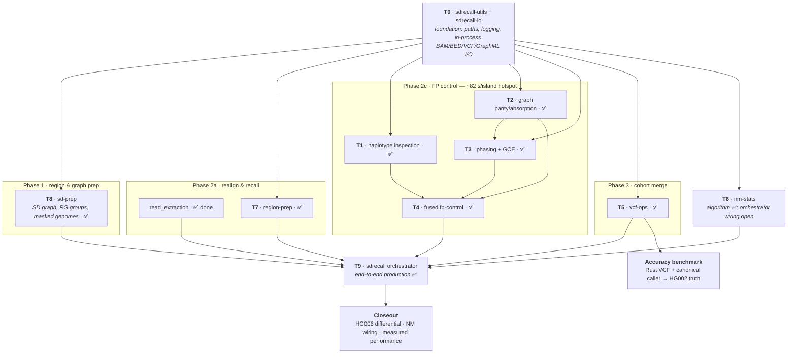

# SDrecall Rust Migration — Hub

**North star:** one production `sdrecall` Rust binary with no Python interpreter and no PyO3 dependency in the production workspace. The July production policy deliberately allows mature external `samtools`, `bcftools`, and `minimap2` commands where they remain the reliable implementation; replacing those commands is no longer a prerequisite for completing the migration.

**Current status (2026-07-17):** the 11-crate Rust workspace and top-level orchestrator run the full pipeline end to end. Production validation is complete on retained t2t/chm13, hg19, and hg38 workloads, including exact semantic parity for 18,140 VCF records, 232 per-group FASTQs, ordered normalized raw/clean BAM record streams, read classifications, clique partitions, and processed-island manifests. The final hg38 run completed in **1:02:05** with 34.4 GiB main-process max RSS; the July resource work reduced PBS virtual-memory high water by 74.0% and sampled peak threads by 76.4% without changing behavior-bearing outputs.

**Open work:** wire the already-validated `nm-stats` Poisson cutoff into the orchestrator's FP-control path; record the formal full-pipeline HG006 Rust-versus-Python differential; continue measured performance work on sequential post-graph inspection, repeated FC/NFC BAM extraction, and overlapping graph/CSR memory; and follow the completed exact HG002 screen with haplotype-aware evaluation plus false-positive stratification. Workspace formatting, strict all-target Clippy, tests, doctests, and release builds pass; the stale PyO3/Python binding surface and its build artifacts were removed on 2026-07-17.

**Historical June milestones:** Phase 2c was fused with **246/246** hybrid-comparison islands matching, phasing matched **270/270** dumped islands, VCF operations matched the HG002 Python outputs, and Phase 1 reached **679/690 (98.4%)** paralog-pair parity with the 11 residuals root-caused and accepted. The 2026-06-14 CORR-1 caveat invalidated the then-current graph-inclusive comparison, but the later three-assembly end-to-end production parity supersedes that temporary validation gap.

## Current Rust workspace

| Area | Crates | State |
|------|--------|-------|
| Foundation and I/O | `sdrecall-utils`, `sdrecall-io` | Production-integrated; shared errors, geometry, resources, BAM/BED/VCF/GraphML/TSV utilities |
| Preparation and realignment | `sd-prep`, `region-prep`, `read_extraction` | Production-integrated across t2t/hg19/hg38; external `samtools`/`minimap2` operations are allowed |
| Graph, phasing, inspection | `phasing`, `haplotype_inspection`, `fp-control` | Fused Rust Phase 2c in production; PyO3/numpy/pyo3-log bindings and build artifacts removed |
| Statistics and VCF operations | `nm-stats`, `vcf-ops` | Algorithms validated; VCF path is production-integrated, while the NM cutoff still needs orchestrator wiring |
| Orchestration | `sdrecall` | Full `run`/`prepare`/`realign` pipeline implemented and validated on three assemblies |

## Migration tasks (docs/analysis/tasks/)

| ID | Crate | Replaces (Python) | Status |
|----|-------|-------------------|--------|
| [T0](tasks/T0_foundation_crates.md) | sdrecall-utils + sdrecall-io | utils/const/I-O glue | **Production-integrated.** The June interface design largely landed; `Paths` remains orchestrator-local, and selected mature external-tool I/O remains allowed. |
| [T1](tasks/T1_validate_haplotype_inspection.md) | haplotype-inspection | identify_misaligned_haps.py | **Production-validated.** June differential/oracle work and later three-assembly parity cover the Rust path; the formal HG006 Rust-versus-Python run remains unrecorded. |
| [T2](tasks/T2_phasing_graph_parity.md) | graph build in `phasing` | graph_build.py | **Complete and absorbed into `phasing`.** The June insertion-marker fix and 270/270 partition result are historical gates now superseded by end-to-end parity. |
| [T3](tasks/T3_port_phasing_gce.md) | phasing | phasing.py + gce_algorithm.py | **Production-integrated.** Sparse graph/GCE execution is live; further CSR/GCE work is performance-only and must be benchmark-driven. |
| [T4](tasks/T4_fuse_fp_control.md) | fp-control | realign_filter_per_cov wiring | **Production-integrated.** Rust graph→phasing→inspection is fused; repeated BAM extraction and post-graph inspection remain optimization targets. |
| [T5](tasks/T5_vcf_ops.md) | vcf-ops | merge_variants_with_priority.py + identify_common_vars.py | **Production-integrated.** The exact hg38 Rust+DeepVariant screen completed; allele recall rose to 0.883880 while precision fell to 0.416613. Haplotype-aware follow-up remains. |
| [T6](tasks/T6_nm_stats.md) | nm-stats | cal_edge_NM_values.py | **Algorithm validated; integration incomplete.** The Poisson cutoff is unit/differential tested but is not yet applied by the orchestrator. |
| [T7](tasks/T7_region_prep.md) | region-prep | prepare_masked_align_region.py | **Production-integrated.** June HG002 FC/NFC byte parity is retained as the focused differential evidence. |
| [T8](tasks/T8_sd_prep.md) | sd-prep | prepare_recall_regions.py + preparation/* | **Production-integrated.** The historical 98.4% Python comparison is supplemented by successful t2t/hg19/hg38 Rust runs. |
| [T9](tasks/T9_orchestrator.md) | sdrecall | CLI + pipeline orchestration | **Production-integrated.** Full three-assembly runs and parity pass; PyO3 cleanup is complete, while the formal HG006 Python differential remains. |

The original two-tier pass criteria remain useful: **unit** tests plus focused Rust-versus-Python differentials. Production acceptance additionally uses end-to-end semantic contracts: normalized VCF records, FASTQs, ordered BAM records, classifications, clique partitions, and processed-island manifests. Compressed bytes and volatile headers are not parity contracts.

## Pipeline phases (Rust production)

- **Phase 1:** `sd-prep` builds the SD graph, RG grouping, masked genomes, and intrinsic BAMs.
- **Phase 2a:** `region-prep` + `read_extraction` + the `sdrecall` orchestrator perform realignment, calling, deduplication, and island slicing; external `minimap2`, `samtools`, and `bcftools` are allowed.
- **Phase 2c:** `phasing` + `haplotype_inspection` + `fp-control` execute the fused Rust graph/phasing/inspection path.
- **Phase 3:** `vcf-ops` performs priority merge and inhouse-common annotation; the canonical-caller exact HG002 screen is complete and now drives haplotype-aware/false-positive follow-up.

## Task workflow & dependencies

How the completed migration tasks map onto the production pipeline and the remaining closeout work:

## Documentation map

| Document | Content |
|----------|---------|
| [RUST_MIGRATION_PLAN.md](RUST_MIGRATION_PLAN.md) | North star, both flowcharts (Python; Python+Rust), crate map + interface principles, task table, current-state appendix, `read_extraction` crate reference |
| [../../rust_modules/README.md](../../rust_modules/README.md) | **Workspace operator guide** — orchestration model + pipeline spine, build env, and a copy-pasteable command + input/output contract for every crate/module |
| [call_stack_and_correspondence.md](call_stack_and_correspondence.md) | haplotype-inspection call stack + 46-row Python↔Rust function table (T1/T4 reference) |
| [module_bam_lappers.md](module_bam_lappers.md) · [module_vector_encoding.md](module_vector_encoding.md) · [module_bilc_solver.md](module_bilc_solver.md) | Validated submodule deep-dives (T1/T4 reference) |
| [tasks/](tasks/) | Per-task interface contract + data-flow diagram, deps, perf bottleneck, tests + pass criteria, progress (T0–T9) |
| [REVIEW_FINDINGS.md](REVIEW_FINDINGS.md) | Code-review issue tracker (2026-06-11) for the 3 migrated crates — duplication / performance / crash-safety / hygiene findings (IDs DUP/PERF/ROB/VER/HYG) with severity, owning task, verification status, and what was fixed; cross-linked from T0/T1/T2/T4/T9 |
