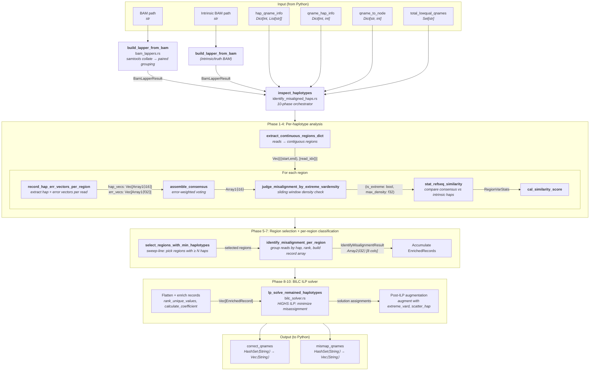

# T1 — Validate `haplotype-inspection` end-to-end

**Crate:** `haplotype-inspection` (existing — `rust_modules/haplotype_inspection/`, lib + examples)
**Status (2026-07-17):** Production-validated in the fused Rust pipeline. Current focused verification includes 187 passing unit tests, one ignored timing test, and 9 separate CIGAR-oracle tests, plus later t2t/hg19/hg38 semantic parity. The formal full-pipeline HG006 Rust-versus-Python differential remains unrecorded.
**Depends on:** T0 (light — can begin against the current crate immediately)
**Track:** Historical June validation track A; complete except for formal HG006 recording.

## Goal & scope boundary

Historical goal: prove the module produces the same `correct_qnames` / `mismap_qnames` behavior before T4 builds the fused core. That gate was completed through the June differential/oracle work and the 246/246 fused comparison; later production parity supersedes the old "not validated" statement.

> The detailed PyO3/wheel workflow below is a historical June validation
> record. The production entry point is now the in-process Rust
> `inspect_haplotypes` API; the bindings and wheels no longer exist.

Out of scope: changing the algorithm; performance tuning (that's T4). Only validation + any bug fixes the validation surfaces.

## Historical June data flow (the inspected island)

PyO3 entry — `inspect_haplotypes_rust` (`python_bindings.rs` → `identify_misaligned_haps.rs`):

```python
correct_qnames, mismap_qnames = inspect_haplotypes_rust(
    bam_path: str,
    intrinsic_bam_path: str,
    hap_qname_info: Dict[int, List[str]],    # {hap_id → [qnames]}
    qname_hap_info: Dict[int, int],          # {vertex_idx → hap_id}
    qname_to_node: Dict[str, int],           # {qname → node_index}
    total_lowqual_qnames: Set[str],
    compare_haplotype_meta_tab: str,         # path to meta table
    mean_read_length: float,
    recall_mq_cutoff: int,
    basequal_median_cutoff: int,
)
# Returns: (List[str], List[str])  — correct qnames, misaligned qnames
```



Full call stack + 46-row Python↔Rust function table in [`../call_stack_and_correspondence.md`](../call_stack_and_correspondence.md); validated submodule deep-dives in [`../module_bam_lappers.md`](../module_bam_lappers.md), [`../module_vector_encoding.md`](../module_vector_encoding.md), [`../module_bilc_solver.md`](../module_bilc_solver.md).

## Dependencies

- The existing crate (`bam_lappers`, `pairwise_read_inspection`, `identify_misaligned_haps`, `bilc_solver`, `python_bindings`) — pinned: `rust-htslib` 0.47.0, `rust-lapper` 1.1, `petgraph` 0.6, `ndarray` 0.15, `half` 2.6, `statrs` 0.16, `highs` 2.0, `ahash` 0.8, `rustc-hash` 1.1, `pyo3` 0.21 (bump to latest at the T4 fuse — see plan skew note).
- Python reference: `fp_control/identify_misaligned_haps.py::inspect_by_haplotypes`.
- The feature-flag seam already exists: `fp_control/realign_filter_per_cov.py:14-20` imports `inspect_haplotypes_rust` and sets `USE_RUST_HAPLOTYPE_INSPECTION`.

## Performance bottleneck / rationale

This crate IS the ~50 s hotspot (of the 82 s per-island budget). The whole speedup claim rests on it. Validating it now de-risks every downstream task.

## Tests

### Unit (tier 1)
- Keep the existing 181 tests green after any build-env changes.
- **Verified 2026-06-10:** `cargo test --release` → 181 passed / 0 failed / 1 ignored (log: `test_tmp/haplotype_inspection_unit_tests_20260610_230407.log`). Build hygiene done the same day: the 5 validation harnesses moved `src/bin/` → `examples/`, and `env_logger` moved to `[dev-dependencies]` (confirmed absent from the normal/cdylib dep tree), so it no longer links into the Python wheel; the suite stays green.

### Differential vs Python (tier 2)
1. Build + install the wheel into the `SDrecall` conda env (`maturin build --release` → `pip install`). See env vars in project `CLAUDE.md`.
2. Add a temporary dump hook in `realign_filter_per_cov.py` that, for each coverage island, records the **inputs** (the 4 dicts/sets + bam paths) and the **Python output** sets, then also calls the Rust path on identical inputs.
3. Run on every island of: HG002 (incl. the already-used `chr1:1633000-1635000`) and HG006.
4. Assert `correct_qnames` and `mismap_qnames` set-equality, island by island.

**Pass criterion:** identical `correct` and `mismap` sets on **100 %** of islands. Any divergence must be root-caused; the only tolerated class is documented float-tie behaviour in similarity-score rounding (1 dp) that does **not** change set membership — and even those get logged.

**Data:** HG002 (chr1 region + full sample), HG006 (the e2e target). Reuse the harness pattern from the 1,568-file BILC cross-validation.

### CIGAR/pileup oracle (tier 3 — encoding-agnostic; becomes the golden-switch gate)

Build a Python-independent oracle that validates the encoding-dependent functions against the **raw alignment** (CIGAR + pileup vs reference), not against Python. Rationale + per-function design in [`../module_vector_encoding.md`](../module_vector_encoding.md) § "Golden-encoding validation". This is built **now** (it reuses the dumped real-island fixtures) and is reused unchanged as the T4 safety net when the encoding flips to golden.

- **Counts** — walk each read's CIGAR: `#SNV = Σ len(X)`, `#indel blocks = # maximal runs of consecutive I/D`; assert against `count_snv`/`count_continuous_indel_blocks`/`count_var`.
- **Consensus** — `rust-htslib` pileup over member reads + reference: independently encode the expected best-quality consensus per ref position and assert equality with `assemble_consensus` over the overlap.
- **Shared variants** — per-side CIGAR/pileup variant maps, intersected by type; assert against `numba_shared_variant_positions`.
- **Fixture** — commit a small real-island BAM slice (`samtools view -b`, <1 MB) + reference under `tests/fixtures/`; load in an inline `#[cfg(test)]` test. Add `proptest` for randomized structurally-valid reads.
- **Expected current-encoding divergence (documented, not a failure):** the count oracle expresses the *true* count, so it disagrees with the current/Python encoding exactly on compound SNV+ins bases (the overwrite undercount). Record the magnitude — it's the quantified motivation for the golden switch, and golden will close the gap.

## Progress
- [x] Build + install wheel in `SDrecall` env — `maturin develop --release` (the `manylinux_2_35` wheel tag is rejected by pip on this el8/glibc-2.28 host, so `develop` is the install path, not `pip install <wheel>`)
- [x] Per-island input/output dump harness — `fp_control/diff_dump.py` (env-gated by `SDRECALL_DIFF_DUMP_DIR`); wired into `realign_filter_per_cov.py` after phasing (T3 dump) and after the Rust inspect (T1 compare). Runs the Python `inspect_by_haplotypes` baseline + compares set-equality; capped by `SDRECALL_DIFF_MAX_INSPECT` (the baseline is the slow path).
- [x] HG002 differential investigation — transitional hybrid differences were root-caused; the fused Rust comparison finished **246/246 islands with 0 mismatch**.
- [ ] Formal HG006 full-pipeline Rust-versus-Python differential — still not recorded.
- [x] Reconcile/root-cause any diffs — **root-caused: a build_phasing_graph insertion-marker off-by-one** (NOT the compound encoding)
- [x] CIGAR/pileup oracle harness (tier 3, counts) — `haplotype_inspection/tests/cigar_counts_oracle.rs` (9 tests, committed). Pileup-consensus oracle still TODO.

### HG002 differential results (2026-06-11, capped re-run, 0 crashes)

Capped at `SDRECALL_DIFF_MAX_INSPECT=15` (raced to 16). Artifacts under `/paedyl01/disk1/yangyxt/test_tmp/diff_dump_HG002_t1/<island>/inspect_diff.json`; run log `…/sdrecall_diff_run_t1/`.

- **13 / 16 islands: exact set-equality** on both `correct` and `mismap` (e.g. 122: py 1795/296 == rust 1795/296; 38: 144/442 ==; 167: 570/139 ==).
- **3 / 16 islands diverge by a few reads, totals conserved (reclassification, not loss):**
  - 137: 3154/481 → 3153/482 (Δ1)
  - 139: 1324/189 → 1316/197 (Δ8)
  - 163: 3074/528 → 3065/537 (Δ9)
- **Divergence shape (island 139, 258 haps):** clean **one-directional** shift — exactly the 8 differing reads are `py=correct ∩ rust=mismap`; `correct_only_rust = 0`, `mismap_only_py = 0`. Rust is marginally more aggressive at calling reads misaligned, only on borderline reads, only on the larger/denser islands.

**ROOT CAUSE (found 2026-06-11) — a `build_phasing_graph` insertion-marker off-by-one, NOT the compound encoding.**

Investigated island 139 (8 reads, clean one-directional flip). The 8 divergent reads contain **zero** compound I→X bases and **zero** deletions — only simple `1I` insertions (e.g. `105=1I42=`) and clustered SNVs / soft-clips. So both overwrite-encoding loss modes are impossible here; **DivB is exonerated for these islands.**

Comparing the dumped `build_phasing_graph` hap vectors (which Python-inspect reuses via the `total_hap_vectors` cache) against the documented current encoding revealed the actual divergence: for `105=1I42=`, `build_phasing_graph` puts the insertion marker at index **104** (`[1,4,1]` — the position *before* the insertion) while Python's `get_hapvector_from_cigar` (`hapvector[index]=insertion` at the next ref op) and `haplotype_inspection::extract_hap_vector` (deferred `pending_ins`) put it at index **105** (`[1,1,4]` — *after*).

- **Buggy code:** `build_phasing_graph/src/haplotype_determination.rs:166-170` — `Cigar::Ins(len) => { let last_idx = hap_vector.len()-1; hap_vector[last_idx] = len*4; }` overwrites the **previous** aligned position instead of deferring the marker to the **next** ref-consuming position.
- **Why it diverges:** Python-inspect consumes `build_phasing_graph`'s exported (marker-before) vectors; Rust-inspect recomputes with the correct (marker-after) convention → a systematic one-position shift at every insertion → borderline reads reclassify (the 1/8/9 flips on islands 137/139/163). **`haplotype_inspection` is correct (matches Python); `build_phasing_graph` is the diverging crate** → this is really a **T2** item.
- **Fix:** port `build_phasing_graph`'s `extract_hap_vector` to the deferred (pending-insertion) convention used by Python + `haplotype_inspection`. Then its exported vectors match. Long-term, T4's shared `sdrecall-utils` encoder removes the duplicate encoder entirely.

### Post-fix result (2026-06-12) — marker fix confirmed, but **NOT 16/16** (hypothesis was too optimistic)

The T2 marker fix was applied + unit-verified (5/5) and the wheel rebuilt; the full HG002 pipeline re-ran with the dumps. Outcome:
- **Island 139: 16 diffs → 0** ✅ — confirms the marker shift was the cause *for the pure-marker island*.
- **T3 phasing: 270/270** still matches on the post-fix matrix (the marker change is benign for phasing).
- **But T1 is NOT 16/16.** 23/26 compared islands match; **3 residuals on the densest islands**: `137` (561 hap, Δ2 — *persisted* unchanged), `136` (93 hap, Δ6), `38` (167 hap, Δ30 **opposite direction** — `correct_only_rust`=15, `mismap_only_py`=15). **Island 38 was clean (0) before the fix.**
- **Interpretation:** the original hypothesis assumed all 3 prior diverging islands (137/139/163) were pure marker-shift like 139. Only 139 was. The marker fix changed the weight matrix → changed the phasing partition → *reshuffled* which islands expose a **pre-existing Python↔Rust difference in the inspect algorithm itself** (borderline reads on dense islands). This residual is **independent of the marker** (fixed), **independent of phasing** (270/270), and **not the compound DivB encoding** (Python and Rust both overwrite, so they agree there). It is the documented float-tie / similarity-rounding class — but here it **does** flip set membership, so the "tolerated unless it changes membership" clause is violated and it must be root-caused.
### Root cause of the residual (2026-06-12) — **numpy-vs-Rust float ties, NOT the compound encoding**

Investigated the user's hypothesis (compound SNV+ins) and the encoders end-to-end:
- **Compound SNV+ins: RULED OUT.** Python `get_hapvector_from_cigar` and Rust `haplotype_inspection::extract_hap_vector` produce **identical** hap vectors in the inspect path. Python's single-`N`-base-mismatch downgrade (X→1) is **dead** because `query_sequence_encoded` is an **int8 array** (`pairwise_read_inspection.py:455`), so `base == "N"` is always False — exactly as the Rust comment claims. Compound I→X overwrites the X with the insertion marker in **both** (identical). The hap encoders agree.
- **Error-vector scale: NOT a mismatch.** Despite `build_phasing_graph::extract_error_vector` computing raw Phred+99 internally, the **exported** err vectors are converted to **probability + 0** before export (`haplotype_determination.rs:450-453`, `10.0_f32.powf(-q/10.0)`), confirmed from `read_err.json` (values `~3.98e-4`, max `0.63`, no 99). That conversion is **bit-identical** to `haplotype_inspection`'s `PHRED_TO_PROB` table (both `10f32.powf(-(q as f32)/10.0)`). So **cached-read err vectors match** between Python-inspect and Rust-inspect.
- **Conclusion:** with compound, the hap marker (fixed), and cached err vectors all eliminated, the residual is **floating-point reimplementation differences between numpy and Rust** — Python's `get_errorvector_from_cigar` uses numpy `10**(-q/10)` for the *non-cached intrinsic/reference* haplotypes (`identify_misaligned_haps.py:929`), and all of Python's consensus / `stat_refseq_similarity` / `cal_similarity_score` math is numpy; Rust uses `powf` + `ndarray`. These differ at the last f32 bit, flipping **borderline reads only on the densest islands** (38=167hap, 137=561hap, 136=93hap; <3% of reads; opposite directions = random-ish tie-breaking). This is the documented **float-tie class**, not a logic bug.
- **It dissolves at T4.** Once `fp-control` fuses the pipeline into **one self-consistent Rust path** (no Python in the loop), there is no numpy-vs-Rust comparison; validation moves to the **CIGAR/pileup oracle** (golden encoding) the plan already designates as the oracle for these float-sensitive functions. So **this residual does NOT block T4** — it is a transitional-hybrid (Rust↔Python↔Rust) artifact. Artifacts: `/paedyl01/disk1/yangyxt/test_tmp/t2_reval_dump/HG002.pooled.raw.deduped.{38,136,137}/inspect_diff.json`.
- [x] CIGAR-count oracle harness — 9 focused tests retained; a committed real-island fixture remains optional regression hardening.
- [x] Record June validation artifact paths under `/paedyl01/disk1/yangyxt/test_tmp/`; July production evidence is under the retained `SDrecall-test/pbs_logs` roots referenced by the progress handoff.

### Finding (2026-06-11) — Rust inspect crashed on **every** real >2-hap island (now fixed)

The first full HG002 CMRG run surfaced a previously-uncaught PyO3 boundary bug: `inspect_haplotypes_rust` raised `TypeError: 'set' object cannot be converted to 'Sequence'` at `realign_filter_per_cov.py:323` on **246 island invocations**. Cause: `hap_qname_info` values are Python **sets** (`defaultdict(set)` in `phasing.py`), but the binding extracts each as `Vec<String>` (a Sequence). The 182 unit tests never exercised this boundary, and the pipeline's blanket `except` swallowed every crash — the example "completed successfully" while **silently dropping all 246 islands' recall** (degraded VCF). This is the headline argument for the differential.

- **Fix (transitional PyO3 shim):** materialise the set values as lists at the call site — `hap_qname_info={k: list(v) for k, v in hap_qname_info.items()}`. Disappears at T4/T9 (partition handed over as Rust types in-process; no PyO3 boundary). The Rust binding could alternatively be made set-tolerant like it already is for `total_lowqual_qnames` — deferred since the boundary is being removed.
- `total_lowqual_qnames` (set) is fine — its binding already downcasts `PySet`/`PyList`/iterable.
- VER-1 was subsequently resolved in the pure-Rust extraction path and covered by the retained FASTQ parity contract.

## Review findings (2026-06-11)

From the migrated-code review — full detail + IDs in [`../REVIEW_FINDINGS.md`](../REVIEW_FINDINGS.md). The differential run is the natural place to settle these.

- **VER-1 (resolved):** checked each threshold against the Python and then validated the production read-selection contract end to end.
  - `bam_reading.rs` — **code is correct** (`>= 75` for both low-qual-count and soft-clip, matching `fp_control/bam_ncls.py`); only the log strings were stale and are now fixed (lines 100/111). Nothing left to do.
  - `read_extraction/lib.rs` now applies the production NFC rule `!SA && (XA || |AS-XS| < 10)` and retains a pair when either mate qualifies; retained t2t/hg19/hg38 FASTQs satisfy the semantic parity gate.
- **ROB-3 (resolved):** `M`-style CIGAR operations return typed `CigarError::UnsupportedMatchOp`; no Python exception boundary or panic guard remains in the production path.
- **PERF-1 (HIGH):** the hot-path copies in `stat_refseq_similarity` are *not* a correctness issue for T1; noted only so the T4 perf pass has a baseline — don't "fix" them here.
