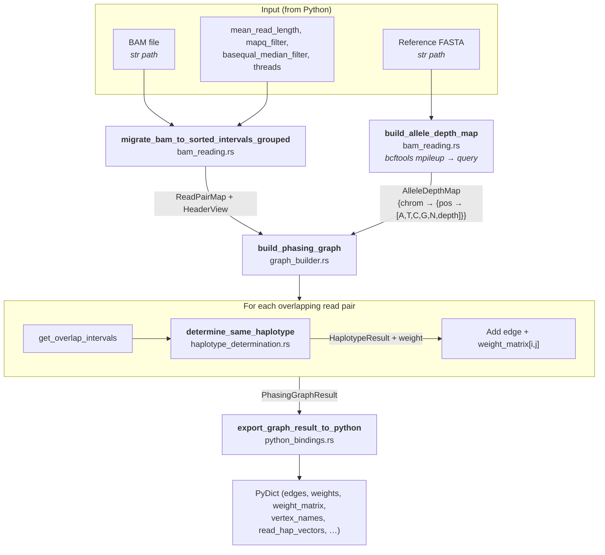

# T2 — Re-confirm `phasing-graph` parity (pre-fuse)

**Crate:** graph-build core now absorbed into `phasing` (`rust_modules/phasing/`)
**Status (2026-07-17):** Complete, validated, and absorbed into the production `phasing` crate. This document preserves the pre-fuse insertion-marker investigation and interface-trim rationale.
**Depends on:** T0
**Track:** Historical precondition for T3/T4; no longer active.

## Goal & scope boundary

`build_phasing_graph` is already Rust-backed and marked Production. This task is a small, focused re-confirmation that its **adjacency + weight matrix + qname↔node mapping** match the Python `graph_build.py` output exactly, because T3 (phasing) and T4 (fuse) consume them directly. It also decides **which of the 9 returned structures survive the fuse**.

Out of scope: re-porting the crate. Only parity confirmation + an interface trim list.

## Data flow

Today (`fp_control/graph_build.py:172`) returns **9** values to Python:
```
phased_graph, weight_matrix(NxN f32; -1 = incompatible),
qname_to_node, total_readhap_vector, total_readerr_vector,
read_ref_pos_dict, total_lowqual_qnames, node_read_ids, read_id_read_dict
```
Post-fuse (T4), only `weight_matrix` + `qname_to_node` (+ `total_lowqual_qnames`) need to cross into `phasing`; the hap/err vectors and read maps are **recomputed once** inside `fp-control` from the single shared BAM reader, so they no longer need to be materialized here. This task produces the authoritative "keep vs drop" list for the fused interface.

### Current Rust crate interface (`build_phasing_graph_rust`)

```python
from build_phasing_graph import build_phasing_graph_rust

result: dict = build_phasing_graph_rust(
    bam_file_path: str, reference_genome: str, mean_read_length: float,
    edge_weight_cutoff: float = 0.201, mapq_filter: int = 10,
    basequal_median_filter: int = 10, filter_noisy: bool = True,
    use_collate: bool = True, threads: int = 4, log_level: Optional[str] = None,
)
```

Returns a `dict`: `edges` (`ndarray[u32,(N,2)]`), `weights` (`ndarray[f32,N]`), `weight_matrix` (`ndarray[f32,(V,V)]`; `-1` = incompatible), `vertex_names` (`List[str]`), `node_read_ids` (`List[(str,Optional[str])]`), `read_hap_vectors`/`read_error_vectors`/`read_ref_pos_dict` (qname-keyed), `low_qual_qnames`, `num_vertices`, `num_edges`. (The Python `graph_build.py` shim repackages these as the 9 positional values above; the **bold** keep-list is what survives the fuse.)



## Dependencies

- Existing `build_phasing_graph` crate — pinned: `rust-htslib` 0.47.0, `petgraph` 0.6, `ndarray` 0.15, `half` 2.6, `statrs` 0.16, `ahash` 0.8, `rustc-hash` 1.1, `pyo3` 0.21.
- Python reference: `fp_control/graph_build.py`.

## Performance bottleneck / rationale

~2 s — not hot. But its PyO3 output (a `graph_tool.Graph` + a dense N×N matrix + 7 dicts) is exactly the **round-trip payload** that T4 eliminates. Confirming parity + trimming the interface is what makes the fuse safe.

## Tests

### Unit (tier 1)
- Graph construction on small synthetic read sets.

### Differential vs Python (tier 2)
- On recorded islands (HG002/HG006), dump the Python `weight_matrix` and node↔qname map; run the Rust crate on the same BAM+region; assert element-wise equality of the matrix and identical node↔qname mapping.

**Pass criterion:** `weight_matrix` element-equal (f32 exact, including the `-1` incompatible sentinel) and identical `qname_to_node`. Produce the documented keep/drop list for the fused interface.

**Data:** recorded islands from HG002/HG006.

## Progress
- [x] **Insertion-marker fix APPLIED** (2026-06-11) — `haplotype_determination.rs::extract_hap_vector` rewritten to the deferred `pending_ins` convention (marker on the **next** ref-consuming op) + explicit `RefSkip(N)` drain, matching `haplotype_inspection::extract_hap_vector` byte-for-byte on `--eqx` data. `M` kept lenient (R-2 — golden DivA deferred to T0/T4). Signature unchanged (`&Record -> Vec<i16>`), so the sole caller (`:477`) is unaffected.
- [x] **`rlib` added** to `build_phasing_graph` crate-type (`["cdylib","rlib"]`) — unblocks the T4 fuse + `cargo test`/examples linking (was the R-4 blocker).
- [x] **Tier-1 unit tests: 5/5 pass** (`cargo test -p build_phasing_graph hap_vector_tests`) — `insertion_marker_is_deferred_to_next_ref_position` (3=1I3= → `[1,1,1,4,1,1]`, marker at idx 3 not 2), `pending_insertion_drains_into_refskip` (the latent **second** off-by-one — 3=1I2N3= → `[1,1,1,4,1,1,1,1]`), `insertion_at_read_start_is_dropped`, `compound_insertion_then_mismatch_overwrites_x` (current encoding preserved), `plain_match_snv_deletion`. Logs: `/paedyl01/disk1/yangyxt/test_tmp/t2_test_20260611.log`, `…/t2_check_20260611.log`.
- [x] **Differential re-validation RAN** (2026-06-12) — rebuilt wheel (`maturin develop --release`, clean), re-ran the full HG002 CMRG example pipeline (ref `ucsc.hg38.fasta`) with `SDRECALL_DIFF_DUMP_DIR=/paedyl01/disk1/yangyxt/test_tmp/t2_reval_dump`, `SDRECALL_DIFF_MAX_INSPECT=25`. Driver log `/paedyl01/disk1/yangyxt/test_tmp/t2_reval_driver_20260611.log`.
  - **T3 phasing: 270/270 islands match** ✅ — the marker fix's weight-matrix change is **benign for phasing parity** (Rust phasing still reproduces Python's partition on the new matrix). Log `/paedyl01/disk1/yangyxt/test_tmp/t2_phasing_differential_20260612.log`.
  - **Marker fix CONFIRMED** ✅ — island **139 went 16 diffs → 0** (the pure-marker-shift case the root-cause was built on).
  - **T1 inspect NOT 16/16** ⚠ — 23/26 compared islands match; **3 residuals** remain on the *densest* islands: `137` (561 hap, Δ2), `136` (93 hap, Δ6), `38` (167 hap, Δ30 **opposite direction**: `correct_only_rust`=15/`mismap_only_py`=15). Island 38 was **clean (0) in the prior run** → the matrix change *reshuffled* which islands expose a **pre-existing Python↔Rust inspect-algorithm difference** (borderline reads on dense islands; the documented float-tie class), which is **independent of the marker** (now fixed) and **independent of phasing** (270/270). **This is a T1 item, not a T2 marker issue** → re-scoped to T1 (root-cause the residual borderline inspect divergence; decide float-tie tolerance vs real bug).
- [x] Matrix + node-map parity — **effectively confirmed via T3 270/270** (Rust phasing matches Python's partition on the post-fix matrix on all islands). A direct element-equality diff vs a fresh pure-Python (marker-after) encoder is still worth a one-off check before the T4 fuse.
- [x] Realize the keep/drop interface in the absorbed `phasing` core and fused `fp-control` path; no Python/PyO3 graph payload crosses the production boundary.

## Review findings (2026-06-11)

From the migrated-code review — full detail + IDs in [`../REVIEW_FINDINGS.md`](../REVIEW_FINDINGS.md). `build_phasing_graph` carries most of the hygiene/cleanup debt; none of it blocks parity, but the re-confirm is a natural time to tidy.

- **Fixed 2026-06-11:** removed a stray `println!` (`python_bindings.rs:76`) that wrote to stdout and ignored the log level (HYG-2).
- **PERF-5 (MED):** `structs.rs:115-128` comment says "binary search" but does a linear scan — use a real binary search when touched.
- **ROB-4 (LOW):** `python_bindings.rs:172` `unwrap` can't actually fail (value exists by construction) — cosmetic, use `expect("…")`.
- **HYG-3/4/5 (LOW):** ~145 lines of "what this does"/Rust-tutorial comments in `graph_builder.rs:15-159`; `get_` getter prefixes; `new()` without `Default`. Cleanup only.
- Cross-ref: this crate is one side of the big cross-crate duplications **DUP-1/DUP-2/DUP-2a** that T0 will consolidate — note the diverged `extract_hap_vector` before the fuse.

### Insertion-marker off-by-one vs Python (found 2026-06-11 via the T1 differential) — fix before fuse

`build_phasing_graph/src/haplotype_determination.rs:166-170` encodes an insertion by overwriting the **previous** aligned position:
```rust
Cigar::Ins(len) => { let last_idx = hap_vector.len()-1; hap_vector[last_idx] = len*4; }
```
Python's `get_hapvector_from_cigar` (`hapvector[index] = insertion` at the next ref-consuming op) and `haplotype_inspection::extract_hap_vector` (deferred `pending_ins`) both place the marker on the **next** position instead. Concretely for `105=1I42=`: this crate emits the marker at index 104, the others at index 105.

This is the **root cause of the 3 diverging T1 islands** (137/139/163): Python-inspect reuses these exported (marker-before) vectors via the `total_hap_vectors` cache, while Rust-inspect recomputes (marker-after) → a one-position shift at every insertion reclassifies borderline reads. `haplotype_inspection` is the correct side. **Fix:** adopt the deferred (pending-insertion) convention here so the exported `read_hap_vectors` match Python + `haplotype_inspection`; re-confirm the weight matrix is unaffected (T3 passed 270/270 on this crate's *current* matrix, but parity vs Python's `graph_build.py` matrix should be re-checked since the marker position feeds the shared-variant comparison). This is the concrete instance of the "diverged `extract_hap_vector`" noted above; T0/T4's shared `sdrecall-utils` encoder removes the duplication for good.

---

## Migration design — frontier propagation (2026-06-11)

This task is **not a port** — `build_phasing_graph` is Production Rust. It is (a) a surgical fix plan for the insertion-marker off-by-one, (b) the differential-parity plan for `weight_matrix` + node↔qname mapping vs the Python reference, and (c) the keep/drop list for the T4 fuse. **Do not apply the code fix in this pass** (it mutates a validated crate; it must be re-validated against the T3 270/270 phasing differential and the T1 16/16 island check first). This section records the exact patch, the re-validation steps, and the keep/drop list so the eventual change is mechanical.

### 1. Python logic inventory

The single function whose semantics the fix must match:

- **`get_hapvector_from_cigar`** — `fp_control/pairwise_read_inspection.py:165-264`. Walks `cigar_tuples`, writing one `int16` per **reference-consuming** base (`M=0` is rejected by `assert operation != 0`; ref-consumers are `{7 '=', 8 'X', 2 'D', 3 'N'}`). Encoding: `1` match, `-4` SNV, `-6` deletion, insertion marker `length*4`. **Control-flow shape:** a single sequential pass with **one carried state variable**, `insertion` (init `False`). It is *not* per-chrom/per-region parallel — it is a per-read scan.

  The **frontier convention** is the load-bearing detail (lines 247-250 vs 202-259):
  - On `I` (op 1, line 247-250): `query_pos += length`; **only set `insertion = length*4`** (deferred — nothing is written yet) and **only if `index > 0`** (insertion at read start is dropped).
  - On the **next ref-consuming op** (`N` 202-211, `=` 212-221, `X` 222-245, `D` 251-259): if `insertion` is truthy, write `hapvector[index] = insertion` (**assignment, overwriting** the value that op would otherwise place at its first base — `1`/`-4`/`-6`), fill `hapvector[index+1 : index+length]` with that op's normal value, then reset `insertion = False`. So the marker lands on the **first base of the op that follows the insertion**, i.e. the next reference position — *not* the previous one.

  Worked example `105=1I42=` (the diverging case): 105 `=` → indices 0..104 set to `1`; `I` → `insertion=4`; 42 `=` → `hapvector[105]=4`, `hapvector[106..147]=1`. **Marker at index 105.** The current crate emits it at index 104.

- **Reference Rust impl already correct:** `haplotype_inspection::extract_hap_vector` — `rust_modules/haplotype_inspection/src/pairwise_read_inspection.rs:83-189`. It carries `pending_ins: i16` (0 = none) and on each ref-consuming arm does `hapvector.push(pending_ins); …repeat_n(normal, n-1); pending_ins = 0`. **This is the convention to copy.** Note it also rejects `M` via `panic!` and the insertion-at-start guard is `if !hapvector.is_empty()` (== Python `index > 0`).

### 2. Python → Rust crate mapping

The fix introduces **no new crate dependency**; it only changes the existing `Cigar` walk. Mapping is therefore tiny:

| Python operation / idiom | Rust crate::api | confidence |
|---|---|---|
| `pysam` cigartuples iteration `for operation, length in cigar_tuples` | `rust_htslib::bam::record::Cigar` variants (`Match/Equal/Diff/Del/Ins/RefSkip/SoftClip/HardClip/Pad`, each `(u32)`), iterated via `record.cigar().iter()` → `&Cigar` | verified-docs (all 9 variants + `u32` field + `len()->u32` confirmed in rust-htslib 0.47.0 docs) |
| `insertion` carried flag (`False` / `length*4`) deferred to next ref op | `let mut pending_ins: i16 = 0;` (0 = none), set on `Ins`, consumed+reset on next ref-consuming arm | verified-docs (live in `haplotype_inspection`) |
| `hapvector[index] = insertion; hapvector[index+1:…]=normal` (assignment-overwrite) | `hapvector.push(pending_ins); hapvector.extend(repeat_n(normal, n-1)); pending_ins = 0;` | verified-docs |
| `if index > 0` insertion-at-start guard | `if !hap_vector.is_empty()` | verified-docs |
| `assert operation != 0` (reject `M`) | this crate currently maps `M` → matches (lenient); see Risk R-2 | plausible |

(The broader `pysam → rust-htslib`, `graph_tool.Graph → petgraph::Graph<(),f32,Undirected>`, `numpy weight_matrix → ndarray::Array2<f32>` mappings are already in place in the Production crate; not re-stated here.)

### 3. Crate file layout (where the fix lands; one-versatile-unit-per-job)

No new files. The change is confined to the **one** function that owns the "CIGAR → hap vector" job:

```
build_phasing_graph/src/
├─ haplotype_determination.rs
│    └─ extract_hap_vector(&Record) -> Vec<i16>   ← lines 147-193: ONLY edit site (Ins arm 166-172 + the 4 ref-consuming arms)
│    └─ get_hap_vector(...)                         ← unchanged (caches extract_hap_vector output)
├─ graph_builder.rs                                 ← unchanged (consumes get_hap_vector via slice_hap_vector / count_variants)
└─ python_bindings.rs                               ← unchanged (exports read_hap_vectors as-is)
```

**One-versatile-unit rule:** `extract_hap_vector` is the single owner of the encoding. The fix must **not** spawn a second "deferred" variant alongside the current one — it edits the existing function in place. The genuine de-duplication (this crate's `extract_hap_vector` vs `haplotype_inspection`'s — cross-crate DUP-1/DUP-2) is **T0/T4's** job: both collapse into `sdrecall-utils::encode_hap_vector`. **Decision for T2:** apply the in-place fix now to make this crate self-consistent with `haplotype_inspection`; do **not** pre-extract a shared helper here (that is upstream orchestration owned by T0, and doing it in T2 would create the exact transient duplicate the rule forbids). Note: this crate's `extract_hap_vector` also walks `Equal/Diff/Del` and threads `pending_ins` through them, so the four ref-consuming arms must all gain the `pending_ins`-drain branch, mirroring `haplotype_inspection` arms (Equal 124-134, Diff 139-151, Del 164-175, RefSkip 113-122). The current crate has **no RefSkip arm** in `extract_hap_vector` (N falls into the `_ =>` matches-as-1 branch) — see Risk R-3.

### 4. Core data structures + key fn signatures (the exact patch)

Signature is **unchanged**: `pub fn extract_hap_vector(record: &Record) -> Vec<i16>` — `&Record` borrow (read-only, only CIGAR is touched; no clone of the record), owned `Vec<i16>` return (caller `get_hap_vector` moves it into the `AHashMap` cache). **WHY:** identical to `haplotype_inspection`'s borrow/own split; matches the existing cache contract at `haplotype_determination.rs:477-478`.

**The patch** — replace the body's per-op loop (current lines 151-190). Add a carried `pending_ins`, defer the marker, and drain it on the next ref-consuming op. Keep the return type `Vec<i16>` (this crate uses `Vec`, not `Array1`, by design):

```rust
pub fn extract_hap_vector(record: &Record) -> Vec<i16> {
    use rust_htslib::bam::record::Cigar;
    let cigar = record.cigar();
    let mut hap_vector: Vec<i16> = Vec::new();
    let mut pending_ins: i16 = 0; // 0 = no pending insertion (mirrors Python `insertion=False`)

    // Helper closure intent (inline, not a new fn — one-unit rule):
    // for each ref-consuming op of length n placing `normal` per base:
    //   if pending_ins == 0 { extend(normal; n) }
    //   else { push(pending_ins); extend(normal; n-1); pending_ins = 0 }

    for &op in cigar.iter() {
        match op {
            Cigar::Match(len) | Cigar::Equal(len) => {
                let n = len as usize;
                if pending_ins == 0 {
                    hap_vector.extend(std::iter::repeat_n(1i16, n));
                } else {
                    hap_vector.push(pending_ins);
                    hap_vector.extend(std::iter::repeat_n(1i16, n.saturating_sub(1)));
                    pending_ins = 0;
                }
            }
            Cigar::Diff(len) => {
                let n = len as usize;
                if pending_ins == 0 {
                    hap_vector.extend(std::iter::repeat_n(-4i16, n));
                } else {
                    hap_vector.push(pending_ins);
                    hap_vector.extend(std::iter::repeat_n(-4i16, n.saturating_sub(1)));
                    pending_ins = 0;
                }
            }
            Cigar::Del(len) => {
                let n = len as usize;
                if pending_ins == 0 {
                    hap_vector.extend(std::iter::repeat_n(-6i16, n));
                } else {
                    hap_vector.push(pending_ins);
                    hap_vector.extend(std::iter::repeat_n(-6i16, n.saturating_sub(1)));
                    pending_ins = 0;
                }
            }
            Cigar::RefSkip(len) => {                 // N: was previously folded into `_ => matches`; now explicit
                let n = len as usize;
                if pending_ins == 0 {
                    hap_vector.extend(std::iter::repeat_n(1i16, n));
                } else {
                    hap_vector.push(pending_ins);
                    hap_vector.extend(std::iter::repeat_n(1i16, n.saturating_sub(1)));
                    pending_ins = 0;
                }
            }
            Cigar::Ins(len) => {                      // DEFER: set marker, write nothing yet
                if !hap_vector.is_empty() {           // == Python `if index > 0`
                    pending_ins = (len as i16) * 4;
                }
            }
            Cigar::SoftClip(_) | Cigar::HardClip(_) | Cigar::Pad(_) => { /* consume query/none, no ref bases */ }
        }
    }
    hap_vector
}
```

**WHY each borrow/own choice:** `&op` over `cigar.iter()` copies the tiny `Cigar` enum (8 bytes) by value — cheaper than a borrow deref and matches existing style. `pending_ins: i16` is a single stack scalar — zero allocation. `repeat_n` (std, stable 1.82) is the same zero-overhead fill `haplotype_inspection` uses. Return stays `Vec<i16>` (no `Array1` here) to avoid touching the cache type `AHashMap<String, Vec<i16>>` and the `python_bindings.rs:238-241` exporter that does `PyArray1::from_vec_bound(py, vec.clone())`.

**Parity caveat (the one subtle difference to verify):** this crate uses `Match(len) | Equal(len)` (lenient `M`), whereas Python/`haplotype_inspection` reject `M`. Since minimap2 `--eqx` never emits `M` on this pipeline's BAMs, the `M` arm is dead and parity holds; but if a non-`--eqx` BAM ever reaches here the two encoders still differ on `M` handling (Risk R-2).

### 5. Performance optimizations from ownership/borrowing

- **No new allocation:** the fix replaces per-op `push` loops with `extend(repeat_n(...))` (one bulk reserve+memset per op) and adds a single `i16` stack scalar — strictly faster than the current element-by-element `for _ in 0..len { push }` (lines 156-158, 162-164, 175-177).
- **`&Record` read-only borrow** throughout — the record is never cloned; only `record.cigar()` (a borrowed `CigarStringView`) is walked.
- **Hot-path neutrality:** `extract_hap_vector` is called once per read and memoized in `get_hap_vector` (`AHashMap<String, Vec<i16>>`), so the fix does not change call frequency or the cache contract — only the bytes written. No rayon axis is introduced (per-read scan; parallelism, if any, belongs to the outer pair loop and is out of scope for this fix).
- **Pre-size opportunity (optional, do not gold-plate):** like `haplotype_inspection` (`Vec::with_capacity(ref_len)`), the ref span could be pre-computed in a first cigar pass to `Vec::with_capacity`. Skip unless a profile shows reallocation cost — the current code already doesn't pre-size, and adding it is orthogonal to the parity fix.

### 6. Risks / open decisions

- **R-1 (parity, the whole point):** the fix shifts every insertion marker by +1 position, which changes the inputs to `slice_hap_vector` → `count_variants`/`find_mismatch_positions_from_hap_vectors`/`stat_shared_snv_matches`/`has_indel_mismatches_from_hap_vectors`. The exported `read_hap_vectors` will then match Python+`haplotype_inspection`, **but the `weight_matrix` may also move** (the marker feeds shared-SNV/indel detection). T3's 270/270 passed on the *pre-fix* matrix, so the matrix must be re-diffed (see §7). Decision: accept a matrix change if and only if it equals what fresh-Python `build_phasing_graph` (the original pure-Python encoder, marker-after) produces.
- **R-2 (`M` divergence):** this crate maps `Cigar::Match` → `1` (lenient); Python and `haplotype_inspection` reject `M` (assert/panic). Harmless under `--eqx`, but the two encoders are not byte-identical for `M`-bearing CIGARs. **Open decision for T0/T4:** when collapsing into `sdrecall-utils::encode_hap_vector`, pick one policy (recommend: reject `M`, matching the golden-encoding DivA decision). Do **not** change `M` handling in this T2 fix (it would broaden the diff beyond the off-by-one and risk a spurious parity miss).
- **R-3 (`N`/RefSkip):** the current `extract_hap_vector` has **no explicit `RefSkip` arm** — `N` falls into `_ => { len matches as 1 }`, which happens to equal Python's `N → 1`. The patch makes it explicit so `pending_ins` is correctly drained on an insertion-then-`N` boundary (currently a `…I` followed by `N` would never see the marker since the `_` arm ignores `pending_ins`). This is a **latent second off-by-one** for `I`-before-`N` CIGARs; the patch fixes it as a side effect. Flag for the differential: ensure no island regresses because of this newly-correct `N` handling (RNA-style N is rare in this DNA pipeline, so expected impact ≈ 0).
- **R-4 (cdylib-only crate):** `Cargo.toml` declares `crate-type = ["cdylib"]` with **no `rlib`**, so an `examples/`-based or `tests/`-dir differential harness cannot `use build_phasing_graph::extract_hap_vector` (no linkable rlib). Two clean options, both no-fallback: (a) add `"rlib"` to `crate-type` (one-line, lets harnesses link the lib — preferred, matches the "harnesses as examples linking the lib" guideline), or (b) keep the differential as a `#[cfg(test)] mod tests` inside `haplotype_determination.rs` run via `cargo test --lib`. Decision: prefer (a) at fix time so the §7 differential can be a real `examples/` harness like the other crates.
- **R-5 (no version skew):** the fix uses only `std::iter::repeat_n` (stable ≥1.82) and the existing `rust-htslib` 0.47.0 `Cigar` API already in use; no dependency bump. The crate still pins `petgraph 0.6`/`statrs 0.16`/`ndarray 0.15` — note for T4 these diverge from the workspace targets (petgraph 0.8.3, statrs 0.18.0), but the encoding fix is independent of those bumps.

### 7. Test plan delta (concrete fixtures + assertions)

**Tier-1 unit (add to `haplotype_determination.rs` `#[cfg(test)] mod tests`)** — copy the canonical fixtures already proven in `haplotype_inspection` so both encoders are byte-identical:

| Fixture (CIGAR @ pos 100) | Expected `extract_hap_vector()` (after fix) | Asserts |
|---|---|---|
| `3=2I3=` | `[1,1,1,8,1,1]` | marker at idx 3 (was idx 2 pre-fix) |
| `3=1I2D3=` | `[1,1,1,4,-6,1,1,1]` | marker drains onto first `D` base |
| `3=1I1X2=` | `[1,1,1,4,1,1]` | marker overwrites the `X` (→ not `-4`) |
| `2I3=` | `[1,1,1]` | insertion-at-start dropped (`index>0` guard) |
| `105=1I42=` | `hap[104]==1 && hap[105]==4` | the exact diverging case from the T1 islands |
| `3=1I2N3=` (R-3) | marker on first `N` base, no panic | covers the latent `I`-before-`N` fix |

These mirror `pairwise_read_inspection.rs:660-744`. **Pass:** all equal; the pre-fix code fails the marker-position asserts.

**Tier-2 differential (the actual T2 deliverable):**
1. **Hap-vector parity:** on the dumped T1 islands (incl. the 3 divergers 137/139/163), assert this crate's exported `read_hap_vectors[qname:flag]` == `haplotype_inspection::extract_hap_vector` **element-equal** for every read (this is the direct off-by-one check; pre-fix it fails at exactly the insertion positions).
2. **Weight-matrix parity (R-1 gate):** run the crate on the same BAM+region as the recorded islands; assert `weight_matrix` is element-equal (f32 exact, incl. the `-1` incompatible sentinel) to the reference. **Reference choice:** the fresh pure-Python `build_phasing_graph` (marker-after encoder) — *not* the crate's own pre-fix output. Confirm `qname_to_node` / `vertex_names` ordering identical.
3. **End-to-end T1 re-run:** rebuild the wheel, re-run the T1 per-island `correct`/`mismap` set-equality on HG002+HG006; the 3 divergers (137/139/163) must now reach **16/16** parity.
4. **T3 re-run:** re-run the phasing differential (must stay **270/270**) on the post-fix matrix; if it moves, R-1 says investigate against fresh-Python before accepting.

**Order of gates:** unit (tier-1) → hap-vector element-equal (#1) → T1 16/16 (#3) → matrix element-equal (#2) → T3 270/270 (#4). Only when all four pass is the fix cleared for the T4 fuse.

### 8. Keep / drop list for the T4 fuse (authoritative)

`graph_build.py:172` returns **9** structures (and the Rust dict carries the 10 keys at `python_bindings.rs:163-269`). After the fuse, `phasing` + `fp-control` only need what crosses the in-process boundary; everything that `fp-control` will **recompute once** from the single shared BAM reader is dropped from this crate's exported interface.

| # | Returned structure (Python `graph_build.py`) | Rust dict key / field | T4 disposition | Why |
|---|---|---|---|---|
| 1 | `phased_graph` (`gt.Graph`) | `edges` + `weights` (`python_bindings.rs:187-188`) | **KEEP** (as in-process `PhasingGraph`, no graph-tool) | `phasing` consumes adjacency directly; the `gt.Graph` rebuild in `graph_build.py:112-162` is deleted. |
| 2 | `weight_matrix` (NxN f32, `-1`=incompatible) | `weight_matrix` (`Array2<f32>`) | **KEEP** | Core phasing input (GCE + clique rounds). Must be the parity-gated artifact (§7 #2). |
| 3 | `qname_to_node` | (implicit: `qname_idx == NodeIndex.index()`; `vertex_names` gives the order) | **KEEP** (as `vertex_names` order; the dict is derivable) | T3/T4 map cliques back to qnames; keep `vertex_names` (the explicit `qname_to_node` dict the shim builds at `graph_build.py:117-122` is redundant given direct correspondence). |
| 4 | `total_readhap_vector` (`read_hap_vectors`) | `read_hap_vectors` | **DROP** | Recomputed once in `fp-control` from the shared BAM reader (the off-by-one fix makes the recompute match, removing the cache-vs-recompute split that caused the T1 divergence). |
| 5 | `total_readerr_vector` (`read_error_vectors`) | `read_error_vectors` | **DROP** | Same — recomputed in `fp-control`. |
| 6 | `read_ref_pos_dict` | `read_ref_pos_dict` | **DROP** | Same — recomputed in `fp-control`. |
| 7 | `total_lowqual_qnames` (`updated_lowqual_qnames`) | `low_qual_qnames` | **KEEP** | Cheap set, produced only here (BAM-filter stage); downstream filtering needs it. |
| 8 | `node_read_ids` | `node_read_ids` | **KEEP** (internal) | Needed to map nodes→read records inside the fused core; stays in-process (no PyO3 marshaling). |
| 9 | `read_id_read_dict` | (built in Python via `pysam.fetch`, `graph_build.py:166-170`) | **DROP** | The extra full-BAM re-fetch the shim does is eliminated; the fused core already holds the records. |

**Survivors crossing into `phasing` (T4 interface):** `weight_matrix` (`Array2<f32>`, `-1` sentinel) + `vertex_names`/node order (≡ `qname_to_node`) + `low_qual_qnames`. `node_read_ids` + the graph adjacency stay in-process. The four qname-keyed dicts (#4/#5/#6) and `read_id_read_dict` (#9) are dropped — `fp-control` recomputes the hap/err/ref-pos vectors once from the shared reader, which is the whole reason the off-by-one must be fixed first (otherwise the recomputed-in-`fp-control` vectors would disagree with the exported-here vectors, exactly the T1 bug).
