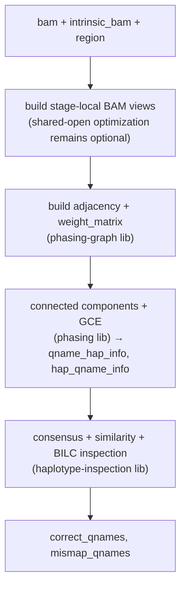

# T4 — Fuse → `fp-control` crate (Rust-only Phase 2c)

**Crate:** `fp-control` (lib + bin; depends on the absorbed graph/phasing core in `phasing` plus `haplotype-inspection`)
**Status (2026-07-17):** Production-integrated. The Rust graph→phasing→inspection path is fused and validated in end-to-end t2t/hg19/hg38 runs. Repeated BAM extraction and sequential post-graph inspection remain performance follow-ups.
**Depends on:** T1 (validated inspection), T2 (graph parity), T3 (phasing)
**Replaces (Python):** the historical orchestration inside `fp_control/realign_filter_per_cov.py:220-346` that wired Rust → Python → Rust.

## Goal & scope boundary

Historical goal: collapse the FP-control compute core into one Rust call with zero PyO3 round-trips. The fused call is in production; the aspirational single-BAM-read part is not yet complete.

```
(bam, intrinsic_bam, region) → correct_qnames, mismap_qnames
```

This is the payoff of T2+T3: phasing-graph, phasing, and haplotype-inspection stop being three separately-bound modules with Python in the middle and become one library pipeline.

Out of scope: the pysam BAM-filtering + `bcftools` call that consumes the qname sets (that moves to the orchestrator T9); the realignment that produces the island BAM (Phase 2a).

## Data flow (fused)



Historical contrast: the hybrid exported a `graph_tool.Graph`, dense N×N matrix, and seven dictionaries to Python before re-entering Rust. The fused path removes that materialization and both language crossings. Some stage-local BAM extraction remains and is tracked only as a measured performance follow-up.

## Dependencies

- The absorbed graph/phasing core in `phasing`, `haplotype-inspection`, and `sdrecall-utils`/`sdrecall-io`. The manifest is intentionally lean; direct dependencies not used by the fused crate were removed during closeout.
- External tools: none in the compute core.

## Performance bottleneck / rationale

Removes: (1) Rust→Python→Rust boundary ×2, (2) graph-tool + dense-matrix materialization, and (3) the Numba GCE hop. The historical **82 s → ~15–25 s** estimate is not a current performance contract; retained stage timings are authoritative. Repeated BAM extraction is still a candidate for measured optimization.

## Tests

### Unit (tier 1)
- Wiring/integration test on a small synthetic island (few reads, 2–3 haplotypes) asserting the end-to-end sets.

### Differential vs Python (tier 2)
- Compare `fp-control` output against **both** (a) the current Rust+Python hybrid and (b) pure Python `inspect_by_haplotypes`, on every HG002 + HG006 island.
- Benchmark wall-time per island vs the 82 s baseline.

**Pass criterion:** `correct`/`mismap` set-equality on the retained differential fixtures and semantic parity in production runs. Performance changes require before/after timing and unchanged outputs; a single BAM open is not a migration requirement.

**Data:** HG002 + HG006 islands; reuse T1/T3 dump harnesses.

## Progress
- [x] Scaffold `fp-control` crate (lib + `--bam --intrinsic --reference -o qnames.tsv` bin) — `run_fp_control(bam, intrinsic, params) -> Option<FpControlOutput>` (2026-06-12).
- [ ] **Eliminate repeated BAM extraction/opens** — still a measured performance follow-up; it is not a correctness or migration blocker.
- [x] Thread phasing-graph → phasing → inspection in-process — Rust structs passed directly; no PyO3, no Python, no file round-trip on the hot path. Glue: `build_partition` derives `hap_qname_info`/`qname_hap_info`/`qname_to_node` from phasing's `vertex_hap`; `phasing_input_from_graph` flattens `node_read_ids` + threads `weight_matrix`/`read_hap`/`read_err` (keyed `"{qname}:{flag}"`).
- [x] Synthetic-island integration test — 3 lib unit tests (partition derivation, ≤2-hap shortcut, phasing-input glue). Log: `test_tmp/fp_control_unit_20260612.log`.
- [x] Differential vs hybrid — `examples/diff_vs_hybrid.rs`: runs the **fused** path on each real island BAM and compares `(correct, mismap)` to the **hybrid** (dumped Python partition → `inspect_haplotypes` on the same BAM). **FINAL: 246/246 islands match, 0 mismatch** (24 skipped = the ≤2-vertex / ≤2-haplotype early-outs that match Python) across the full spectrum incl. the densest (island 137: 3155 correct + 479 mismap; 274: 248/47; 303: 148/42) and all-mismap edge cases — **the numpy-vs-Rust float-tie residual dissolves once Python leaves the loop, exactly as the T1 root-cause predicted.** Phasing partition itself is 270/270 identical to Python (T3 harness). Log: `/paedyl01/disk1/yangyxt/test_tmp/fp_control_diff_vs_hybrid_20260612.log`.
- **Key result:** T4 both delivers the Phase-2c consolidation (no PyO3 round-trip, no Python phasing hop) **and empirically closes the T1 residual** — the fused Rust path == the hybrid's Rust inspect on every island, so T1's "float-tie that dissolves at T4" is now demonstrated, not just predicted.
- [x] Run production stage/resource benchmarks with semantic parity on t2t/hg19/hg38; the selected production pairing configuration is `samtools-pipe` with `--island_threads 2`.

### Deferred (per task scope discipline)
- **PERF pass (PERF-1/2/3)** — sequential `inspect_haplotypes` kept; no parallel/`Arc` rewrite.
- **Golden encoding (DivA/DivB)** — completed: typed `M`-CIGAR rejection, `INDEL_UNIT=10`, `HAP_PAD=-20`, and compound-event decoding are live and oracle-tested.
- **Single-shared-BAM-read** — still optional performance work requiring a shared inspection input API; it does not block the production fused path.

## Review findings (2026-06-11)

From the migrated-code review — full detail + IDs in [`../REVIEW_FINDINGS.md`](../REVIEW_FINDINGS.md). The fuse is the right home for the performance work and must carry two correctness/robustness reconciliations.

**Performance (the speedup agenda — do as a benchmarked pass here).** Agreed plan + acceptance gate (2026-06-11):
- **Method (mandatory):** keep the ORIGINAL sequential version (`inspect_haplotypes_seq`) in-tree alongside the new parallel version (`inspect_haplotypes_par`); do **not** replace in place. Gate the rewrite on an **inline `#[cfg(test)]` differential equality test** that runs both on the same input and asserts identical `(correct, mismap)` sets. Parallel is "done" only when it matches sequential on every input. Test inputs must be real-world: dump a real HG002/HG006 island's `inspect_haplotypes` inputs (phasing maps + a small committed BAM slice under `tests/fixtures/`) during the T1 run; complement with `proptest`. The test also guards determinism (parallel reduce must be schedule-independent → sort/normalize order-dependent outputs).
- **Step 1 — PERF-1 (HIGH, verified):** `identify_misaligned_haps.rs:607-710` (`stat_refseq_similarity`) clones cached vectors on every hit and `.to_owned()`s slices passed to read-only callees. Generalize `ref_genome_similarity`/`numba_shared_variant_positions` to take `ArrayView1<i16>` (removes the `.to_owned()` at 643-644); wrap cache values in `Arc` so a hit is a refcount bump, not a deep copy.
- **Step 2 — PERF-2 (HIGH):** the per-haplotype (`:2000`) and per-region (`:2153`) loops are single-threaded. Blocker is the shared `&mut` caches; with `Arc` values, swap to `DashMap` and `par_iter()` the independent per-`hid`/per-region work, reducing per-unit outputs after the parallel section. Fixing PERF-1 unlocks PERF-2.
- **Step 3 — PERF-3/4 (MED):** default-hash maps/sets on hot paths instead of the fast-hash convention; every read cloned into the per-island store (`bam_lappers.rs:519`).
- Re-run the T1 diff + benchmark per-island after **each** step.

**Encoding/robustness resolution:** DivA/DivB are implemented. The strict extractor returns typed `CigarError` values, golden insertion/deletion encoding is used by every consumer, and the CIGAR/pileup oracle plus fused output parity provide the regression gate. Workspace panics unwind, while known input-validation failures use typed errors.
